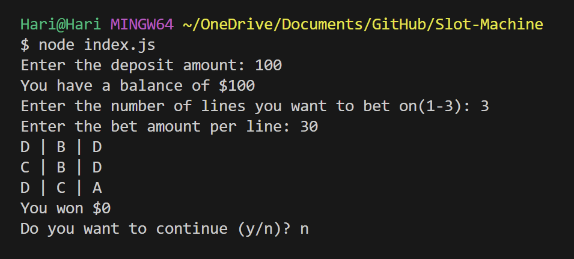

# Simple slot machine w/  JavaScript

It is a simple project to understand basic concepts like **variables**, **conditions**, and **functions**.

It is a program that allows users to bet on the slots, there are three slot lines, and they can bet on them. You will win the bet if all the symbols in a slot line are equal, else you will lose money.

## How to Run

Go to the project directory and run the following command.

```node index.js``` 



## Thankyou

If there are any queries, feel free to connect with me on [Twitter](https://twitter.com/ItsHariharanc)
